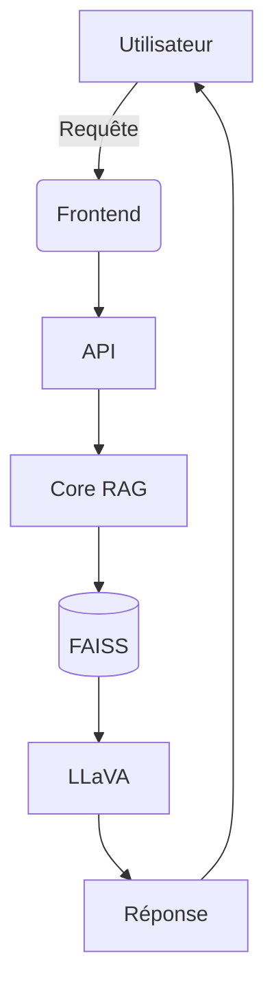

# Architecture Simplifiée pour POC RAG Multimodal

```text
📁 multimodal-poc/
├── 📁 core/                  # Cœur fonctionnel
│   ├── 📄 rag_pipeline.py    # Pipeline principal
│   ├── 📄 embeddings.py      # Gestion des embeddings
│   └── 📄 llm_integration.py # Intégration LLaVA
│
├── 📁 data/                  # Données et modèles
│   ├── 📁 raw/               # Données brutes
│   ├── 📁 processed/         # Données vectorisées
│   └── 📁 models/            # Modèles (CLIP, LLaVA)
│
├── 📁 api/                   # API minimale
│   └── 📄 app.py             # FastAPI
│
├── 📁 frontend/              # Interface basique
│   └── 📄 index.html         # Page unique
│
├── 📁 scripts/               # Utilitaires
│   ├── 📄 setup.sh           # Installation
│   └── 📄 ingest.py          # Chargement données
│
└── 📄 config.yaml            # Configuration
```

## Composants Essentiels

### 1. Core (📁 core)
```python
# rag_pipeline.py
class MultimodalRAG:
    def __init__(self):
        self.embedder = ClipEmbedder()
        self.vector_db = FAISS()
        self.llm = LlavaClient()
    
    def query(self, text: str, image: Image) -> str:
        # 1. Générer embedding multimodal
        embedding = self.embedder(text, image)
        
        # 2. Recherche vectorielle
        results = self.vector_db.search(embedding)
        
        # 3. Génération réponse
        return self.llm.generate(results)
```

### 2. Données (📁 data)
```text
data/
├── raw/
│   ├── 📄 documents.pdf      # Exemple de données
│   └── 📁 images/            # Images de test
│
├── processed/
│   └── 📄 faiss_index        # Index vectoriel
│
└── models/
    ├── clip/                 # Modèle CLIP
    └── llava/               | LLaVA 7B
```

### 3. API (📁 api)
```python
# app.py
app = FastAPI()

@app.post("/search")
async def search(query: dict):
    return rag_pipeline.query(query["text"], query["image"])
```

### 4. Frontend (📁 frontend)
```html
<!-- index.html -->
<div class="container">
  <input type="text" id="query">
  <input type="file" id="image">
  <button onclick="search()">Rechercher</button>
  <div id="results"></div>
</div>
```

## Workflow Simplifié



## Configuration Minimale
```yaml
# config.yaml
rag:
  model: "llava:7b"
  top_k: 5
  weights:
    text: 0.7
    image: 0.3

storage:
  vector_db: "faiss"
  path: "./data/processed/faiss_index"
```

## Bonnes Pratiques Conservées

1. **Séparation des responsabilités** :  
   - Core (logique métier)
   - API (interface)
   - Data (gestion des données)

2. **Configuration externalisée** :  
   ```python
   # Dans rag_pipeline.py
   import yaml
   
   with open("config.yaml") as f:
       config = yaml.safe_load(f)
   ```

3. **Gestion des dépendances** :  
   ```bash
   # scripts/setup.sh
   pip install fastapi uvicorn faiss-cpu transformers
   ```

4. **Versioning basique** :  
   ```text
   data/
   ├── v1/
   └── v2/  # Version actuelle
   ```

Cette architecture permet de :
- Développer rapidement un prototype fonctionnel
- Maintenir une base évolutive
- Tester les composants clés (CLIP, LLaVA, FAISS)
- Faciliter la démo avec une interface simple

Pour lancer le POC :
```bash
# Installer les dépendances
bash scripts/setup.sh

# Lancer l'API
uvicorn api.app:app --reload

# Ouvrir le frontend
open frontend/index.html
```
</think>

Voici l'architecture simplifiée pour votre POC RAG Multimodal :

```markdown:POC_ARCHITECTURE.md
# Architecture POC RAG Multimodal

```text
📁 multimodal-poc/
├── 📁 core/
│   ├── 📄 rag.py            # Pipeline principal
│   ├── 📄 embeddings.py     # CLIP + combinaison
│   └── 📄 llm.py            # Intégration LLaVA
│
├── 📁 data/
│   ├── 📁 raw/              # Documents/Images
│   └── 📁 vectors/          # Index FAISS
│
├── 📁 api/
│   └── 📄 server.py         # API FastAPI
│
├── 📁 web/
│   └── 📄 index.html        # Interface simple
│
└── 📄 config.py             # Paramètres globaux
```

## Fichiers Clés

**core/rag.py** (Cœur fonctionnel) :
```python
class RAGSystem:
    def __init__(self):
        self.embedder = MultimodalEmbedder()
        self.vector_db = FAISS.load('data/vectors')
        self.llm = LLaVA()
    
    def query(self, text: str, image_path: str):
        embedding = self.embedder(text, image_path)
        results = self.vector_db.search(embedding, top_k=3)
        return self.llm.generate(results)
```

**api/server.py** (Endpoints) :
```python
from fastapi import FastAPI

app = FastAPI()
rag = RAGSystem()

@app.post("/query")
async def handle_query(text: str, image: UploadFile):
    return rag.query(text, image.file)
```

**web/index.html** (Interface) :
```html
<!DOCTYPE html>
<html>
<body>
    <input type="text" id="query" placeholder="Votre question...">
    <input type="file" id="image" accept="image/*">
    <button onclick="submit()">Envoyer</button>
    <div id="result"></div>
</body>
</html>
```

## Workflow d'Exécution

1. **Installation** :
```bash
pip install fastapi uvicorn faiss-cpu transformers pillow
```

2. **Lancement** :
```bash
uvicorn api.server:app --reload
```

3. **Utilisation** :
```javascript
// Dans index.html
async function submit() {
  const formData = new FormData();
  formData.append('text', document.getElementById('query').value);
  formData.append('image', document.getElementById('image').files[0]);

  const response = await fetch('/query', {
    method: 'POST',
    body: formData
  });
  
  document.getElementById('result').innerText = await response.text();
}
```

Cette architecture minimaliste permet de :
1. Tester rapidement le flux RAG complet
2. Valider les performances de base
3. Démontrer la fonctionnalité multimodale
4. Servir de base pour l'évolution future

Les composants peuvent être étendus progressivement selon les besoins sans surcharge initiale.