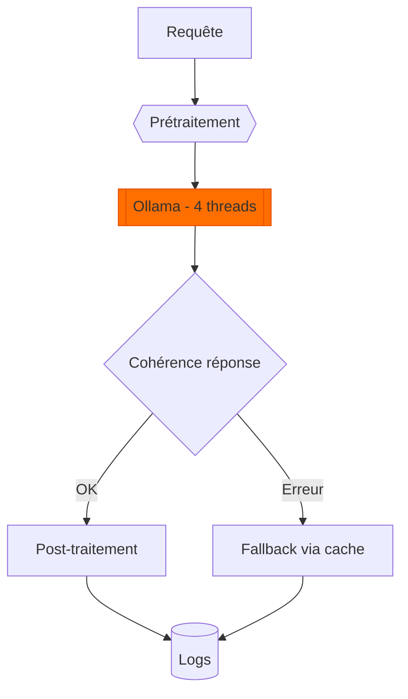

# Flowchart

```mermaid
flowchart TD
    A[Requête] --> B{{Prétraitement}}
    B --> C[[Ollama - 4 threads]]
    C --> D{Cohérence réponse}
    D -->|OK| E[Post-traitement]
    D -->|Erreur| F[Fallback via cache]
    E --> G[(Logs)]
    F --> G
    style C fill:#FF6F00,stroke:#E65100
``` 